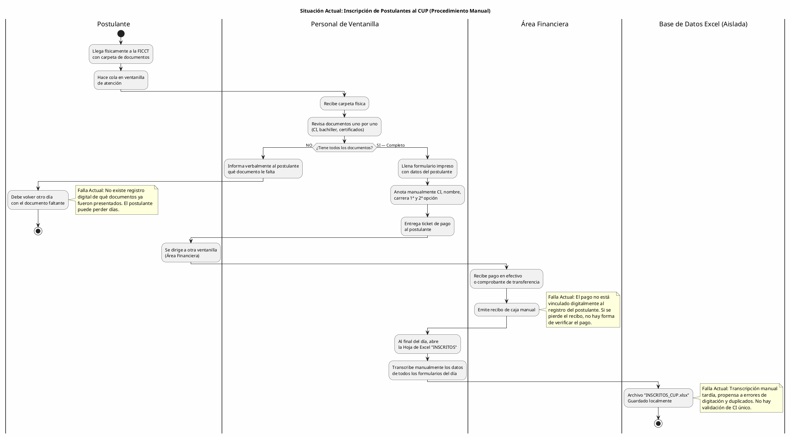
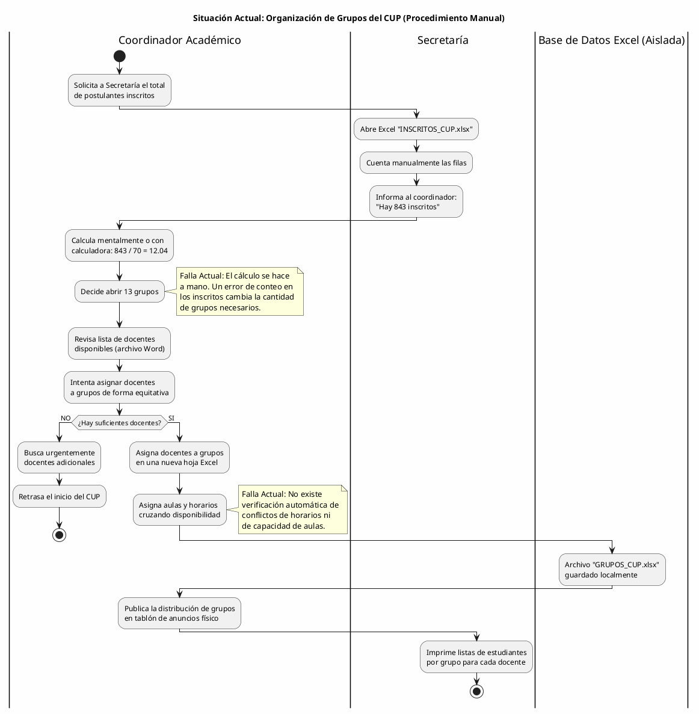
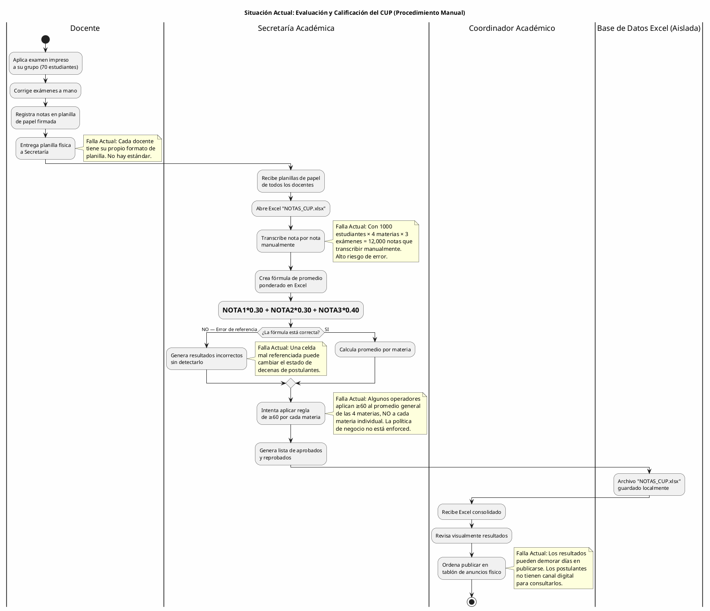
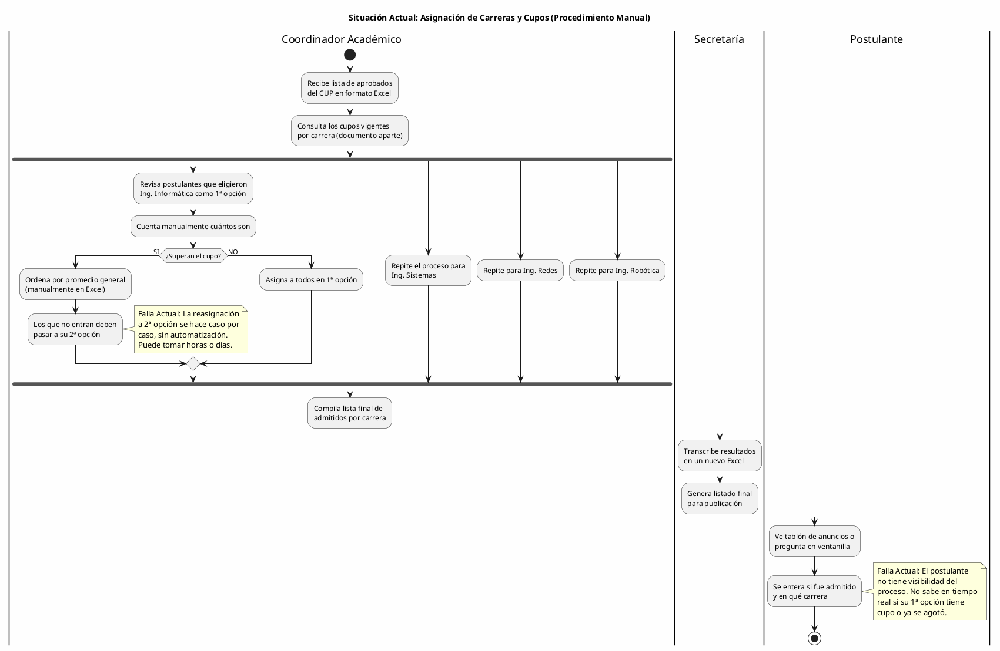
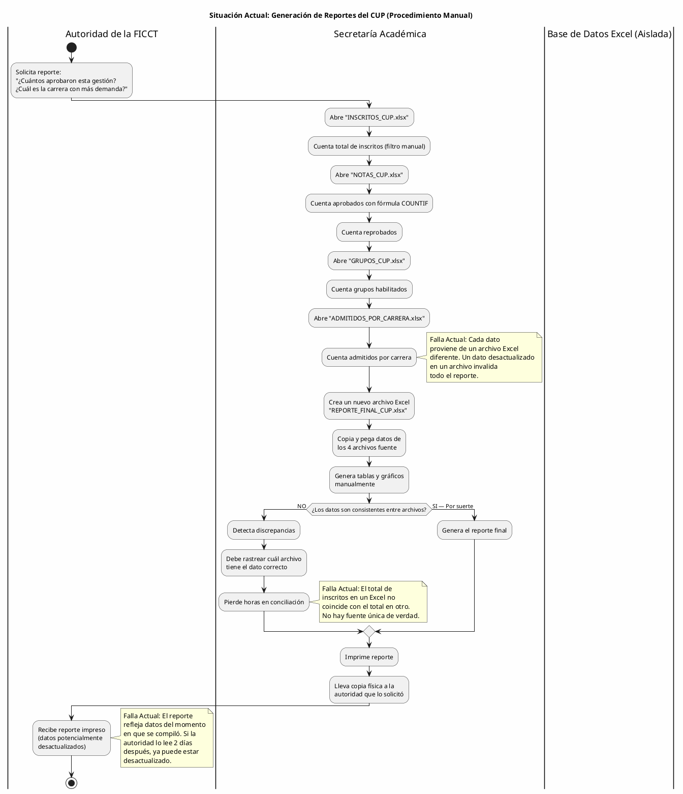

Universidad Autónoma Gabriel René Moreno

FACULTAD DE INGENIERÍA EN CIENCIAS DE LA COMPUTACIÓN Y TELECOMUNICACIONES

---

**Sistema Web Inteligente de Gestión del Proceso de Admisión y Curso Preuniversitario (CUP) para la FICCT — UAGRM**

---

Integrantes:

- Alberto
- Andy

Docente: Msc. Ing. Angélica Garzón Cuéllar

Materia: Sistemas De Información I

Gestión: 1-2026

Grupo: 15

SANTA CRUZ — BOLIVIA

---

# ÍNDICE DE CONTENIDO

1. [PERFIL](#1-perfil)
   - 1.1 [INTRODUCCIÓN](#11-introducción)
   - 1.2 [OBJETIVOS](#12-objetivos)
     - 1.2.1 [Objetivo General](#121-objetivo-general)
     - 1.2.2 [Objetivos Específicos](#122-objetivos-específicos)
   - 1.3 [DESCRIPCIÓN DEL PROBLEMA](#13-descripción-del-problema)
   - 1.4 [ALCANCE](#14-alcance)
2. [MARCO TEÓRICO](#2-marco-teórico)
3. [MODELO DE NEGOCIO](#3-modelo-de-negocio)

---

# 1. PERFIL

## 1.1 INTRODUCCIÓN

La Facultad de Ingeniería en Ciencias de la Computación y Telecomunicaciones (FICCT) de la Universidad Autónoma Gabriel René Moreno (UAGRM) constituye uno de los centros académicos con mayor demanda estudiantil del departamento de Santa Cruz, Bolivia. Cada gestión académica, la facultad recibe un volumen considerable de postulantes — cifras que en determinados periodos han superado los mil aspirantes — que desean ingresar a alguna de sus cuatro carreras de ingeniería: Informática, Sistemas, Redes y Telecomunicaciones, y Robótica. Estos postulantes deben inscribirse y aprobar un Curso Preuniversitario (CUP) como mecanismo de nivelación y selección antes de ser admitidos formalmente como estudiantes regulares.

El proceso de admisión mediante el CUP involucra múltiples subprocesos interrelacionados: la recepción de documentación y requisitos de los postulantes, la verificación de cumplimiento, el pago de la matrícula a través de mecanismos formales, el registro en el sistema, la organización de grupos por capacidad de aula, la asignación de docentes calificados a cada grupo y materia, la aplicación de tres exámenes por cada una de las cuatro materias evaluadas (Computación, Matemáticas, Inglés y Física), el cálculo de promedios ponderados, la determinación del estado final de cada postulante (aprobado o reprobado) según políticas de negocio específicas, y finalmente la asignación a una carrera respetando los cupos disponibles por gestión.

En la actualidad, una parte significativa de estos procesos se gestiona mediante procedimientos manuales, hojas de cálculo aisladas y comunicaciones informales, lo cual genera ineficiencias operativas, errores de cálculo, demoras en la publicación de resultados, dificultades para generar reportes consolidados y una experiencia deficiente tanto para los postulantes como para el personal administrativo y docente de la facultad.

El presente proyecto propone el desarrollo de un **Sistema Web Inteligente de Gestión del Proceso de Admisión y Curso Preuniversitario (CUP) para la FICCT**, una solución de software integral que permitirá digitalizar, centralizar y optimizar todos los procesos involucrados en la admisión universitaria. El sistema será desarrollado con tecnologías modernas: **PHP con el framework Laravel** en el backend, **React.js** como librería de frontend, **PostgreSQL** como motor de base de datos relacional, y será desplegado en **infraestructura cloud** para garantizar accesibilidad 24/7 desde cualquier dispositivo.

Como elemento diferenciador, el sistema incorporará capacidades de **inteligencia artificial para la generación de reportes mediante comandos de voz**, un **asistente virtual (chatbot) para guiar a los postulantes** en tiempo real durante el proceso de inscripción, y un **sistema de notificaciones en tiempo real** mediante WebSockets que mantendrá informados a todos los actores sobre el estado de sus trámites. Estas funcionalidades posicionan al sistema no solo como una herramienta administrativa, sino como una plataforma moderna centrada en la experiencia del usuario.

---

## 1.2 OBJETIVOS

### 1.2.1 Objetivo General

Analizar, diseñar y desarrollar un Sistema Web Inteligente para la Gestión Integral del Proceso de Admisión y Curso Preuniversitario (CUP) de la FICCT — UAGRM, que permita digitalizar, centralizar y automatizar los procesos de inscripción de postulantes, gestión académica de evaluaciones, asignación de grupos, contratación de docentes y generación de reportes estadísticos, aplicando la metodología del Proceso Unificado de Desarrollo de Software (PUDS) y el Lenguaje Unificado de Modelado (UML).

### 1.2.2 Objetivos Específicos

1. Recolectar los requisitos funcionales y no funcionales del sistema mediante el análisis de los procesos actuales de admisión de la FICCT, identificando las necesidades específicas de cada actor involucrado (postulantes, docentes, coordinadores y autoridades).

2. Analizar los requisitos recolectados para identificar los procesos críticos del CUP, definir los casos de uso por módulo funcional y establecer las especificaciones que guiarán el diseño del sistema, diferenciando claramente las reglas de negocio académicas de las reglas operativas.

3. Diseñar la arquitectura del sistema y el modelo de base de datos relacional en PostgreSQL, garantizando la integridad referencial y la trazabilidad de los datos entre los módulos de inscripción, evaluación, asignación de grupos y reportes.

4. Implementar el backend del sistema utilizando PHP con el framework Laravel, asegurando la conexión robusta con PostgreSQL, la validación de datos en servidor, el manejo de sesiones seguras y la implementación de roles y permisos diferenciados por tipo de usuario.

5. Implementar el frontend del sistema utilizando React.js con diseño responsivo, proporcionando una interfaz web intuitiva, accesible y profesional tanto para dispositivos de escritorio como para dispositivos móviles.

6. Desarrollar los módulos funcionales del sistema (autenticación, registro de postulantes, gestión de exámenes, asignación de grupos, gestión de docentes, reportes y panel administrativo), aplicando las reglas de negocio definidas por la administración académica de la FICCT.

7. Integrar una pasarela de pago electrónico (Stripe) para la gestión segura de los pagos de inscripción, condicionada a la verificación previa del cumplimiento de todos los requisitos documentales del postulante.

8. Implementar un módulo de reportes inteligentes con capacidad de generación mediante comandos de voz utilizando servicios de reconocimiento de voz con IA, exportación a formatos PDF y Excel, y visualización en un dashboard estadístico interactivo.

9. Desarrollar un asistente virtual (chatbot) integrado en la plataforma que guíe a los postulantes durante el proceso de inscripción, respondiendo preguntas frecuentes sobre requisitos, fechas, estados de trámite y resultados.

10. Realizar pruebas funcionales de cada módulo del sistema, gestionar el control de versiones mediante GitHub y desplegar la solución en infraestructura cloud, verificando el correcto funcionamiento integral del sistema.

---

## 1.3 DESCRIPCIÓN DEL PROBLEMA

La Facultad de Ingeniería en Ciencias de la Computación y Telecomunicaciones (FICCT) de la UAGRM administra cada gestión académica un proceso de admisión mediante el Curso Preuniversitario (CUP), destinado a evaluar, nivelar y seleccionar a los aspirantes que ingresarán como estudiantes regulares a alguna de sus cuatro carreras: Ingeniería Informática, Ingeniería de Sistemas, Ingeniería de Redes y Telecomunicaciones, e Ingeniería en Robótica. Este proceso involucra la recepción de documentación, la inscripción formal, la organización de grupos académicos, la asignación de docentes, la aplicación y calificación de exámenes, y la determinación final del estado de admisión de cada postulante. A continuación, se describen en detalle los problemas identificados en cada dimensión del proceso actual.

### 1. Proceso de inscripción manual y fragmentado

El problema más estructural que enfrenta la FICCT en su proceso de admisión es la inexistencia de un sistema de información unificado que integre y centralice los datos de todos los subprocesos del CUP. Actualmente, cada etapa del proceso — recepción de documentos, verificación de requisitos, registro de pago, asignación a grupo — opera de forma aislada, sin un mecanismo digital que permita compartir, relacionar ni consolidar la información en tiempo real.

Los postulantes deben presentar físicamente un conjunto de requisitos documentales (carnet de identidad, título de bachiller, certificados, entre otros). La verificación de estos requisitos se realiza de forma manual, lo que introduce demoras significativas y la posibilidad de que un postulante avance en el proceso sin haber cumplido la totalidad de los requisitos. No existe un sistema de check-list digital que garantice la completitud documental antes de habilitar el pago.

### 2. Gestión de pagos sin trazabilidad digital

El pago de la inscripción al CUP se gestiona actualmente mediante mecanismos presenciales que no están integrados con el registro académico del postulante. No existe una pasarela de pago electrónico que vincule automáticamente la transacción financiera con el expediente digital del aspirante. Esta desconexión genera situaciones en las que un postulante aparece como "pagado" en el área financiera pero no está registrado en el sistema académico, o viceversa.

La ausencia de una pasarela digital también impide que los postulantes de otras ciudades o del área rural puedan completar su inscripción de forma remota, obligándolos a desplazarse físicamente hasta las oficinas de la facultad, lo cual representa un costo adicional y una barrera de acceso para aspirantes de zonas alejadas.

### 3. Cálculo manual de grupos y asignación ineficiente de recursos

Cuando la cantidad de inscritos al CUP supera los mil postulantes, la organización de grupos se convierte en un desafío logístico considerable. Actualmente, el cálculo de la cantidad de grupos necesarios (considerando un máximo de 70 estudiantes por grupo) se realiza de forma manual o semi-manual, lo que retrasa el inicio de las clases y genera errores de asignación.

La distribución de estudiantes en grupos, la asignación de aulas, horarios (mañana, tarde, noche) y la vinculación de docentes a cada grupo y materia se realizan mediante hojas de cálculo que no están interconectadas. Si un grupo tiene 71 inscritos, se requiere la apertura inmediata de un segundo grupo, pero este dato no se refleja automáticamente en la planificación de aulas ni en la carga horaria docente. Esta falta de automatización provoca que se asignen aulas con capacidad insuficiente, que docentes queden con sobrecarga no detectada, o que grupos queden sin docente asignado en alguna materia.

### 4. Evaluación y calificación sin validación automatizada

El proceso de evaluación del CUP contempla tres exámenes por cada una de las cuatro materias evaluadas (Computación, Matemáticas, Inglés y Física), con ponderaciones definidas por la administración académica (30%, 30% y 40% respectivamente). La calificación se realiza en una escala de 0 a 100, donde el postulante debe obtener una nota final mayor o igual a 60 en **cada materia individualmente** para ser considerado aprobado — no basta con que el promedio general de las cuatro materias supere 60.

Actualmente, el registro de notas, el cálculo de promedios ponderados y la determinación del estado del postulante (aprobado/reprobado) se realizan mediante hojas de cálculo con fórmulas manuales. Este método presenta múltiples riesgos:

- **Errores de fórmula:** Una fórmula mal referenciada puede cambiar el estado de aprobación de decenas de estudiantes sin que nadie lo detecte.
- **Falta de validación de rango:** No existe un mecanismo que impida ingresar notas fuera del rango 0-100 o que detecte valores anómalos (ej: una nota de 999).
- **Demora en resultados:** Al depender de procesamiento manual para cientos o miles de postulantes, la publicación de resultados puede demorar días.
- **Política de negocio no enforced:** La regla de que cada materia debe aprobarse individualmente con ≥60 no está impuesta sistémicamente; depende de que el operador aplique correctamente la fórmula condicional en cada caso.

### 5. Asignación de carreras sin respeto automático de cupos

Cada carrera de la FICCT maneja un cupo máximo de admisión por gestión. Cuando un postulante aprueba el CUP, debe ser asignado a su primera opción de carrera. Si los cupos de esa carrera ya están agotados, el sistema (actualmente manual) debería reasignarlo automáticamente a su segunda opción de carrera. Si ambas opciones están llenas, el postulante queda en una situación excepcional que debe resolverse caso por caso.

La gestión manual de este proceso de asignación es altamente propensa a errores, especialmente cuando cientos de postulantes aprueban simultáneamente y los cupos se agotan en tiempo real. Sin un sistema que controle atómicamente la disponibilidad de cupos y realice la asignación de forma determinista, se producen situaciones de sobre-asignación (más estudiantes admitidos que cupos disponibles) o sub-asignación (cupos vacantes mientras postulantes aprobados quedan sin carrera asignada).

### 6. Contratación de docentes sin visibilidad de carga horaria

La contratación de docentes para el CUP requiere profesionales con título de licenciatura en el área correspondiente, maestría y diplomado en educación superior. Cada docente puede ser asignado de 1 hasta 4 grupos por materia. Sin embargo, la gestión actual no cuenta con un sistema que visualice en tiempo real la carga horaria acumulada de cada docente, lo que puede resultar en asignaciones inequitativas o en docentes con más grupos de los permitidos.

### 7. Ausencia de reportes consolidados y dashboard analítico

La generación de reportes estadísticos (cantidad total de inscritos, aprobados, reprobados, grupos habilitados, estadísticas por materia, carrera con mayor demanda, docentes por grupo, grupo con mayor cantidad de aprobados) se realiza de forma manual compilando datos dispersos en múltiples hojas de cálculo. Este proceso es lento, propenso a errores y no permite a las autoridades de la facultad tomar decisiones oportunas basadas en datos.

No existe un panel de control (dashboard) que presente indicadores estadísticos en tiempo real. Las autoridades deben esperar a que el personal administrativo compile manualmente los datos al finalizar cada ciclo de evaluación, lo que puede demorar varios días. En una gestión con más de mil postulantes, esta demora tiene un impacto directo en la capacidad de respuesta institucional.

### 8. Experiencia del postulante desatendida

El postulante actual carece de un canal digital oficial para consultar el estado de su inscripción, verificar si sus requisitos fueron aceptados, conocer el grupo y horario que le fue asignado, o consultar sus resultados de evaluación. La comunicación se realiza mediante tablones de anuncios físicos, grupos de WhatsApp informales o consultas presenciales en ventanilla.

Esta falta de transparencia genera ansiedad en los postulantes, saturación en las ventanillas de atención y una imagen institucional que no corresponde con una facultad de ingeniería en ciencias de la computación. La implementación de un chatbot asistente y un sistema de notificaciones en tiempo real resolvería esta problemática, proporcionando al postulante una experiencia digital moderna y accesible.

### 9. Gestión de postulantes recurrentes sin continuidad de datos

Los postulantes que reprobaron el CUP en una gestión anterior y desean volver a intentarlo en la siguiente gestión no deben re-registrarse como nuevos; deben conservar su código original y simplemente realizar un nuevo pago para habilitarse. Sin un sistema que identifique automáticamente a los postulantes recurrentes por su CI, se corre el riesgo de duplicar registros, perder el historial de intentos previos o permitir que un postulante que ya agotó sus oportunidades vuelva a inscribirse.

### 10. Impacto general y necesidad de intervención tecnológica

El conjunto de problemas descritos configura un escenario de vulnerabilidad operativa para la administración del CUP en la FICCT. La facultad se encuentra ante una demanda creciente de postulantes gestión tras gestión, pero sin las herramientas tecnológicas necesarias para gestionarla de forma eficiente, transparente y escalable. La dependencia de procesos manuales y hojas de cálculo no integradas constituye el principal obstáculo para ofrecer un proceso de admisión ágil, confiable y justo.

En conclusión, la problemática del proceso de admisión CUP de la FICCT puede sintetizarse en ocho dimensiones críticas interrelacionadas: (1) inscripción manual y fragmentada, (2) pagos sin trazabilidad digital, (3) cálculo y asignación ineficiente de grupos, (4) evaluación sin validación automatizada, (5) asignación de carreras sin control de cupos, (6) contratación docente sin visibilidad de carga, (7) ausencia de reportes y dashboard, y (8) experiencia del postulante desatendida. El desarrollo del Sistema Web propuesto busca dar respuesta integral a la totalidad de estos problemas.

---

## 1.4 ALCANCE

El Sistema Web Inteligente de Gestión del Proceso de Admisión y Curso Preuniversitario (CUP) para la FICCT abarcará la totalidad del ciclo de admisión, desde la inscripción del postulante hasta la asignación final a una carrera, estructurándose en **8 Módulos Funcionales principales** y **2 Módulos Diferenciadores** que incorporan inteligencia artificial y comunicación en tiempo real:

---

### 1.4.1 Módulo de Autenticación y Autorización (RBAC)

Permite gestionar el acceso seguro al sistema mediante un esquema de control de acceso basado en roles (Role-Based Access Control). Cada usuario del sistema (administrador, coordinador, docente, postulante) accede únicamente a las funcionalidades correspondientes a su perfil, garantizando la seguridad de la información y la segregación de responsabilidades. **Datos principales:**

- ID Usuario (PK, autoincremental)
- Nombre completo y Correo electrónico (único)
- Contraseña (almacenada mediante hash bcrypt, nunca en texto plano)
- Rol jerárquico (Administrador / Coordinador / Docente / Postulante)
- Estado de cuenta (Activo / Inactivo / Bloqueado)
- Último acceso (timestamp) y contador de intentos fallidos
- Token de sesión (JWT) con expiración configurable

**Funcionalidades clave:**

- Inicio de sesión seguro con validación de credenciales
- Cierre de sesión con destrucción de token
- Recuperación de contraseña mediante envío de enlace al correo electrónico
- Bloqueo temporal de cuenta tras 3 intentos fallidos consecutivos
- Cambio de contraseña propia con validación de políticas de seguridad (mínimo 8 caracteres, mayúsculas, minúsculas y números)
- Gestión de perfiles de usuario por parte del Administrador
- Registro de bitácora de accesos (login/logout) con fecha, hora e IP

---

### 1.4.2 Módulo de Registro y Gestión de Postulantes

Permite registrar, actualizar, buscar y listar a los postulantes que aspiran ingresar a la FICCT mediante el CUP. Implementa la verificación obligatoria de requisitos documentales como condición previa al pago e integra una pasarela de pago electrónico para la formalización de la inscripción. **Datos principales:**

- ID Postulante (PK) / Código único de postulante
- CI (Cédula de Identidad, único, validación de duplicidad)
- Nombres y Apellidos completos
- Fecha de nacimiento y Sexo
- Dirección domiciliaria y Ciudad de residencia
- Teléfono de contacto y Correo electrónico (validado)
- Colegio de procedencia
- Título de bachiller (referencia a documento digital subido)
- Primera opción de carrera (FK a tabla de carreras)
- Segunda opción de carrera (FK a tabla de carreras)
- Gestión de inscripción (ej: 1-2026, 2-2026)
- Estado del postulante (Preinscrito / Inscrito / En Evaluación / Aprobado / Reprobado)
- Bandera de postulante recurrente (boolean) e historial de intentos previos

**Funcionalidades clave:**

- Registro de postulante con formulario completo y validaciones en tiempo real
- Verificación de requisitos mediante checklist digital (todos deben estar marcados como cumplidos para habilitar el pago)
- Integración con pasarela de pago Stripe para procesamiento seguro de la matrícula
- Modificación de datos personales (mientras el estado sea Preinscrito o Inscrito)
- Búsqueda avanzada por CI, nombre, carrera, estado o gestión
- Detección automática de postulantes recurrentes por CI (mantiene código original, no genera duplicado)
- Listado paginado con filtros dinámicos y exportación
- Eliminación lógica (soft delete) preservando historial

---

### 1.4.3 Módulo de Gestión Académica y Exámenes

Centraliza el registro, cálculo y control de las evaluaciones del CUP. Cada postulante rinde tres exámenes por cada una de las cuatro materias (Computación, Matemáticas, Inglés, Física), con ponderaciones predefinidas. El sistema calcula automáticamente los promedios ponderados y determina el estado del postulante aplicando las reglas de negocio de forma sistémica e inquebrantable. **Datos principales:**

- ID Examen (PK)
- ID Postulante (FK)
- ID Materia (FK)
- Número de examen (1, 2 o 3)
- Nota obtenida (decimal, rango validado 0-100)
- Fecha de aplicación del examen
- ID Docente evaluador (FK)

**Reglas de negocio implementadas sistémicamente:**

| Regla | Implementación |
|---|---|
| 3 exámenes por materia | El sistema no permite registrar un 4° examen |
| Ponderación 30% - 30% - 40% | Configurable por administración, aplicada automáticamente |
| Nota entre 0 y 100 | Validación de rango en frontend y backend |
| Aprobación ≥ 60 por CADA materia | No se usa promedio general; cada materia se evalúa individualmente |
| Estado APROBADO | Solo si las 4 materias tienen nota final ≥ 60 |
| Estado REPROBADO | Si al menos 1 materia tiene nota final < 60 |

**Funcionalidades clave:**

- Registro individual de notas por examen con validación de rango
- Carga masiva de notas mediante archivo CSV/Excel (para procesar lotes de 500-1000 estudiantes)
- Cálculo automático del promedio ponderado por materia
- Determinación automática del estado del postulante (APROBADO/REPROBADO)
- Visualización de notas por postulante, por materia, por grupo y por docente
- Generación aleatoria de notas de prueba (mediante seed) para demostración del sistema con datos realistas
- Edición de notas con registro en bitácora de auditoría (quién modificó, cuándo, valor anterior y nuevo)

---

### 1.4.4 Módulo de Asignación de Grupos y Horarios

Gestiona la organización automática de los postulantes inscritos en grupos de estudio, respetando el límite máximo de 70 estudiantes por grupo. Vincula cada grupo con un aula, un horario y los docentes correspondientes. **Datos principales:**

- ID Grupo (PK)
- Número de grupo (secuencial por gestión)
- Gestión académica (FK)
- Turno / Horario (Mañana / Tarde / Noche)
- ID Aula asignada (FK)
- Cantidad actual de estudiantes (calculado dinámicamente)
- Estado del grupo (Abierto / Cerrado / Completo)

**Algoritmo de cálculo de grupos:**

```
Cantidad de Grupos = CEIL(Total Inscritos / 70)

Ejemplo:
- 70 inscritos  → 1 grupo
- 71 inscritos  → 2 grupos
- 140 inscritos → 2 grupos
- 141 inscritos → 3 grupos
- 1000 inscritos → 15 grupos (ceil(1000/70) = 15)
```

**Funcionalidades clave:**

- Cálculo automático de la cantidad de grupos necesarios según inscritos
- Distribución equitativa de estudiantes entre los grupos disponibles
- Asignación de aula y horario a cada grupo
- Visualización de la composición de cada grupo (listado de estudiantes asignados)
- Reasignación manual de estudiantes entre grupos (por el administrador)
- Indicador visual de capacidad (grupo lleno / con cupo disponible)

---

### 1.4.5 Módulo de Gestión de Docentes y Carga Horaria

Permite registrar a los docentes contratados para el CUP, gestionar sus datos profesionales y controlar su carga horaria de forma transparente. Cada docente puede ser asignado a entre 1 y 4 grupos, y el sistema garantiza que este límite no sea excedido. **Datos principales:**

- ID Docente (PK)
- CI del docente (único)
- Nombres y Apellidos completos
- Especialidad / Área de conocimiento (Computación / Matemáticas / Inglés / Física)
- Grado académico (Licenciatura, Maestría, Diplomado en Educación Superior)
- Correo electrónico institucional y Teléfono
- Estado (Activo / Inactivo)
- Carga horaria asignada (cantidad de grupos, máximo 4)

**Funcionalidades clave:**

- Registro de docentes con validación de requisitos profesionales
- Asignación de docentes a grupos y materias con control de carga máxima (1-4 grupos)
- Visualización de la carga horaria de cada docente (cuántos grupos tiene, en qué turnos)
- Alerta automática cuando un docente alcanza su carga máxima de 4 grupos
- Listado de docentes filtrable por materia, carga horaria y estado
- Los docentes acceden al sistema con su cuenta y pueden ver únicamente los datos de los grupos y estudiantes de su carga asignada

---

### 1.4.6 Módulo de Admisión y Asignación de Carreras

Ejecuta la lógica final de admisión, asignando a los postulantes aprobados a su carrera correspondiente según sus preferencias y la disponibilidad de cupos por gestión. Este módulo implementa el algoritmo de reasignación automática cuando la primera opción de carrera está agotada. **Datos principales:**

- ID Admisión (PK)
- ID Postulante (FK)
- Carrera asignada (FK a tabla de carreras)
- Gestión de admisión
- Mecanismo de asignación (Primera opción / Segunda opción / Reasignación administrativa)
- Fecha de admisión

**Cupos por carrera (configurables por gestión):**

| Carrera | Cupo por Gestión (ejemplo) |
|---|---|
| Ingeniería Informática | Variable, definido por la facultad |
| Ingeniería de Sistemas | Variable, definido por la facultad |
| Ingeniería de Redes y Telecomunicaciones | Variable, definido por la facultad |
| Ingeniería en Robótica | Variable, definido por la facultad |

**Algoritmo de asignación:**

```
PARA cada postulante APROBADO (ordenado por promedio general descendente):
  SI hay cupo en su PRIMERA OPCIÓN de carrera:
    → Asignar a primera opción
  SINO SI hay cupo en su SEGUNDA OPCIÓN de carrera:
    → Asignar a segunda opción
  SINO:
    → Marcar como "Pendiente de Reasignación Administrativa"
    → Notificar al coordinador
FIN PARA
```

**Funcionalidades clave:**

- Ejecución del algoritmo de asignación masiva de carreras
- Visualización de cupos disponibles por carrera en tiempo real
- Configuración de cupos por gestión por el administrador
- Reasignación manual en casos excepcionales
- Reporte de postulantes asignados por carrera y mecanismo utilizado

---

### 1.4.7 Módulo de Reportes e Inteligencia Estadística

Genera reportes consolidados y exportables que permiten a las autoridades de la facultad tomar decisiones informadas basadas en datos puros. Incluye tres mecanismos de consulta: estructurada (preconfigurada), dinámica (filtros interactivos) y por comando de voz (IA). **Datos principales de los reportes:**

- Filtros de período temporal (Gestión, Desde Fecha — Hasta Fecha)
- Filtros por carrera, grupo, materia, docente y estado

**Reportes obligatorios:**

1. Lista general de postulantes (con estado y datos completos)
2. Postulantes aprobados (con notas por materia y promedio general)
3. Postulantes reprobados (identificando las materias no aprobadas)
4. Promedios generales por gestión
5. Cantidad de grupos habilitados por gestión
6. Estadísticas por materia (promedio, máximo, mínimo, desviación estándar)
7. Docentes asignados por grupo
8. Grupo con mayor cantidad de aprobados
9. Carrera con mayor demanda (1ª opción vs 2ª opción)
10. Comparativa histórica entre gestiones (tendencias de inscripción y aprobación)

**Formatos de exportación:**

- PDF (reportes formales con membrete institucional)
- Excel / CSV (para procesamiento externo)

**Mecanismos de consulta:**

1. **Reporte Estructurado:** Reportes predefinidos con formato fijo, generados con un clic
2. **Reporte Dinámico:** El usuario selecciona filtros interactivos (por nombre, grupo, gestión, materia) y el sistema genera el reporte a medida
3. **Reporte por Comando de Voz (IA):** El usuario dicta una consulta en lenguaje natural (ej: *"Muéstrame los aprobados de la gestión 1-2026 de Ingeniería de Sistemas"*). El sistema utiliza la Web Speech API para capturar el audio, lo convierte a texto, procesa la consulta mediante un servicio de IA y genera el reporte correspondiente

---

### 1.4.8 Módulo de Panel Administrativo (Dashboard)

Proporciona una vista consolidada y en tiempo real de los indicadores estadísticos más relevantes del proceso de admisión. Diseñado para que las autoridades de la facultad tengan visibilidad inmediata del estado del CUP sin necesidad de generar reportes individuales. **Indicadores del dashboard:**

- Total de postulantes inscritos (con indicador de variación respecto a la gestión anterior)
- Total de postulantes que completaron evaluaciones
- Total de aprobados y porcentaje de aprobación
- Total de reprobados y porcentaje de reprobación
- Cantidad de grupos habilitados (con indicador de ocupación)
- Distribución de postulantes por carrera (gráfico circular)
- Carrera con mayor demanda (destacada visualmente)
- Ranking de grupos por tasa de aprobación
- Ranking de docentes por promedio de sus estudiantes
- Evolución histórica de admisiones por gestión (gráfico de líneas)
- Estado de cupos por carrera (barra de progreso visual)
- Alerta de gestiones con postulantes pendientes de asignación

---

### 1.4.9 Módulo Diferenciador: Asistente Virtual Inteligente (Chatbot IA)

*(Funcionalidad exclusiva del Grupo 15 — Elemento diferenciador)*

Integra un asistente virtual basado en inteligencia artificial directamente en la plataforma web, accesible para los postulantes desde cualquier página del sistema. El chatbot responde preguntas frecuentes sobre el proceso de inscripción, requisitos documentales, fechas importantes, estado de trámites y resultados de evaluación, reduciendo la carga sobre las ventanillas de atención presencial y mejorando la experiencia del postulante. **Datos principales:**

- Historial de conversaciones por postulante
- Base de conocimiento del CUP (requisitos, fechas, políticas, FAQs)
- Registro de preguntas no respondidas (para mejora continua)

**Funcionalidades clave:**

- Interfaz de chat flotante accesible desde cualquier página (widget en esquina inferior derecha)
- Respuestas contextualizadas al proceso de admisión de la FICCT
- Consulta de estado de inscripción por CI del postulante
- Información sobre requisitos documentales y fechas límite
- Redirección a módulos específicos del sistema según la consulta del usuario
- Integración con servicio de IA (OpenAI API o similar) para procesamiento de lenguaje natural
- Funcionamiento 24/7 sin intervención humana

---

### 1.4.10 Módulo Diferenciador: Sistema de Notificaciones en Tiempo Real

*(Funcionalidad exclusiva del Grupo 15 — Elemento diferenciador)*

Implementa un sistema de notificaciones push en tiempo real mediante WebSockets que mantiene informados a todos los actores del sistema sobre eventos relevantes del proceso de admisión, sin necesidad de que el usuario refresque la página o consulte activamente. **Datos principales:**

- ID Notificación (PK)
- ID Usuario destinatario (FK)
- Tipo de evento (Inscripción confirmada / Pago procesado / Grupo asignado / Notas publicadas / Resultado final)
- Mensaje descriptivo
- Estado (Leída / No leída)
- Timestamp de generación y de lectura

**Eventos que disparan notificaciones:**

| Evento | Destinatario | Mensaje ejemplo |
|---|---|---|
| Pago procesado exitosamente | Postulante | "Tu pago ha sido verificado. Ya estás inscrito al CUP." |
| Asignación de grupo | Postulante | "Has sido asignado al Grupo 7, turno Mañana." |
| Publicación de notas | Postulante | "Las notas del Examen 2 de Computación han sido publicadas." |
| Resultado final | Postulante | "¡Felicidades! Has sido APROBADO y admitido en Ingeniería de Sistemas." |
| Cupo agotado | Coordinador | "El cupo de Ing. Informática se ha agotado. 12 postulantes reasignados a 2ª opción." |
| Carga máxima docente | Administrador | "El docente Juan Pérez ha alcanzado su carga máxima de 4 grupos." |

**Funcionalidades clave:**

- Centro de notificaciones integrado en la barra de navegación (icono de campana con contador)
- Actualización en tiempo real sin refresco de página (WebSockets con Laravel Reverb o Pusher)
- Historial de notificaciones leídas y no leídas
- Marcar como leída individual o masivamente
- Notificaciones por correo electrónico como complemento (configurable por el usuario)

---

# 2. MARCO TEÓRICO

En este capítulo se establecen los fundamentos conceptuales, metodológicos y tecnológicos que sustentan el desarrollo del Sistema Web Inteligente de Gestión del CUP para la FICCT. El marco teórico se estructura en tres dimensiones: el marco conceptual (dominio del problema), el marco metodológico (proceso de ingeniería de software) y el marco tecnológico (herramientas y plataformas de implementación).

---

## 2.1 Marco Conceptual: Gestión Académica y Admisión Universitaria

### 2.1.1 Proceso de Admisión Universitaria

El proceso de admisión universitaria constituye el mecanismo formal mediante el cual una institución de educación superior selecciona a los aspirantes que ingresarán como estudiantes regulares. En el contexto de la UAGRM, la admisión se realiza a través de Cursos Preuniversitarios (CUP) que evalúan las competencias académicas de los postulantes en áreas fundamentales. Este proceso implica la gestión coordinada de múltiples actores (postulantes, docentes, coordinadores y autoridades) y subprocesos (inscripción, evaluación, calificación y admisión).

### 2.1.2 Sistemas de Información Académica

Un Sistema de Información Académica es una aplicación informática diseñada para capturar, almacenar, procesar y distribuir datos relacionados con los procesos educativos de una institución. Según la clasificación clásica de sistemas de información, el sistema propuesto se enmarca dentro de la categoría de un **Sistema de Procesamiento de Transacciones (TPS)**, cuya función principal es recolectar, procesar y almacenar los datos detallados de las transacciones rutinarias del proceso de admisión (inscripciones, pagos, calificaciones, asignaciones de grupo), permitiendo posteriormente la generación de reportes operativos e indicadores de rendimiento para la toma de decisiones.

### 2.1.3 Control de Acceso Basado en Roles (RBAC)

El modelo RBAC (Role-Based Access Control) es un enfoque de seguridad de la información que restringe el acceso a los recursos del sistema en función del rol asignado a cada usuario, en lugar de asignar permisos individuales. En el contexto del CUP, este modelo permite que los administradores gestionen todos los módulos, los docentes accedan solo a las evaluaciones de sus grupos asignados, los coordinadores supervisen la operación general, y los postulantes consulten únicamente su información personal y resultados.

### 2.1.4 Pasarelas de Pago Electrónico

Una pasarela de pago (Payment Gateway) es un servicio que autoriza y procesa pagos electrónicos de forma segura entre un comprador y un vendedor. El estándar PCI DSS (Payment Card Industry Data Security Standard) rige la seguridad de las transacciones. Para el presente proyecto, se utiliza **Stripe**, una plataforma de pagos que maneja internamente el cumplimiento PCI DSS, la tokenización de datos sensibles y la gestión de transacciones, liberando al sistema de la responsabilidad de almacenar datos de tarjetas.

---

## 2.2 Marco Metodológico: Ingeniería de Software

### 2.2.1 Proceso Unificado de Desarrollo de Software (PUDS)

El PUDS (también conocido como RUP — Rational Unified Process en su variante comercial) es un proceso de desarrollo de software que proporciona un marco disciplinado para asignar tareas y responsabilidades dentro de una organización de desarrollo. Según Jacobson, Booch y Rumbaugh, el PUDS se caracteriza por tres propiedades fundamentales:

1. **Dirigido por Casos de Uso:** Los casos de uso son el artefacto primario que guía todo el desarrollo. Cada funcionalidad del sistema se modela como un caso de uso que describe la interacción entre un actor y el sistema.

2. **Centrado en la Arquitectura:** La arquitectura del software se define tempranamente y sirve como esqueleto sobre el que se construyen iterativamente las funcionalidades. Las decisiones arquitectónicas prioritarias reducen el riesgo técnico.

3. **Iterativo e Incremental:** El software no se construye de una sola vez, sino mediante ciclos de realimentación (iteraciones) donde cada ciclo produce un incremento funcional verificable. Cada iteración incluye actividades de requisitos, análisis, diseño, implementación y pruebas.

**Fases del Ciclo de Vida del PUDS:**

| Fase | Propósito | Aplicación en este Proyecto |
|---|---|---|
| **Inicio (Inception)** | Establecer la visión, alcance y viabilidad del proyecto | Perfil del proyecto, descripción del problema, alcance y objetivos |
| **Elaboración** | Analizar el dominio, establecer la arquitectura base y mitigar riesgos | Modelo de negocio, captura de requisitos, análisis y diseño arquitectónico |
| **Construcción** | Implementar iterativamente todos los componentes del sistema | Desarrollo de los módulos funcionales en 2 ciclos iterativos |
| **Transición** | Entregar el sistema al usuario y verificar su operación en producción | Despliegue en la nube, pruebas finales y defensa |

**Plan de Iteraciones para el Proyecto:**

El desarrollo se organiza en **2 Ciclos de Construcción**, siguiendo el principio iterativo-incremental del PUDS:

- **Ciclo 1 (Presentación 1 — 31 de mayo):** Arquitectura base, autenticación, registro de postulantes, asignación de grupos y estructura de base de datos.
- **Ciclo 2 (Presentación 2 — 9 de junio):** Gestión de exámenes, cálculo de resultados, asignación de carreras, reportes, dashboard, chatbot y notificaciones.

### 2.2.2 Lenguaje Unificado de Modelado (UML 2.5)

UML (Unified Modeling Language) es el estándar internacional (ISO/IEC 19501) para visualizar, especificar, construir y documentar los artefactos de un sistema de software. UML proporciona un vocabulario gráfico común que permite a los ingenieros de software comunicar las decisiones de diseño de forma precisa y no ambigua.

**Diagramas UML utilizados en el proyecto:**

| Diagrama | Categoría | Uso en el Proyecto |
|---|---|---|
| Diagrama de Casos de Uso | Comportamiento | Modelar las interacciones entre actores y el sistema |
| Diagrama de Actividades | Comportamiento | Modelar los procesos de negocio (AS-IS y TO-BE) |
| Diagrama de Secuencia | Interacción | Detallar la comunicación entre objetos en cada caso de uso |
| Diagrama de Clases | Estructura | Modelar la estructura estática del sistema y las relaciones entre entidades |
| Diagrama de Comunicación | Interacción | Mostrar la interacción entre objetos con énfasis en las conexiones |
| Diagrama de Componentes | Estructura | Representar la arquitectura física del sistema |
| Diagrama de Despliegue | Estructura | Modelar la distribución del sistema en nodos de hardware/cloud |

---

## 2.3 Marco Tecnológico y de Infraestructura

### 2.3.1 PHP y Laravel Framework

PHP (Hypertext Preprocessor) es un lenguaje de programación del lado del servidor ampliamente utilizado para el desarrollo web. **Laravel** es un framework PHP de código abierto que implementa el patrón arquitectónico MVC (Model-View-Controller), proporcionando una estructura elegante y expresiva para el desarrollo de aplicaciones web. Laravel incluye de forma nativa: un ORM potente (Eloquent) para la interacción con la base de datos, un sistema de migraciones para el versionado del esquema de BD, un sistema de autenticación y autorización configurable, un motor de colas para trabajos asíncronos, y soporte nativo para WebSockets a través de Laravel Reverb.

### 2.3.2 React.js como Librería de Frontend

React.js es una librería de JavaScript desarrollada por Meta (Facebook) para la construcción de interfaces de usuario basadas en componentes reutilizables. React utiliza un DOM Virtual (Virtual DOM) que optimiza las actualizaciones de la interfaz, proporcionando una experiencia fluida similar a una aplicación nativa. Su modelo declarativo y basado en componentes facilita el mantenimiento y la escalabilidad del código frontend.

### 2.3.3 PostgreSQL como Motor de Base de Datos Relacional

PostgreSQL es un sistema de gestión de bases de datos relacional de código abierto que garantiza las propiedades **ACID** (Atomicidad, Consistencia, Aislamiento y Durabilidad). Estas propiedades son fundamentales para el sistema del CUP, ya que aseguran que las transacciones críticas — como el registro de un pago, el descuento de un cupo de carrera o la determinación del estado de un postulante — no se pierdan, corrompan ni dupliquen ante fallos eléctricos, de red o de concurrencia.

PostgreSQL soporta además funciones almacenadas (PL/pgSQL), triggers para auditoría automática, índices avanzados para consultas de alto rendimiento y tipos de datos JSON para almacenamiento flexible de metadatos.

### 2.3.4 Infraestructura Cloud y Despliegue

El sistema será desplegado en infraestructura cloud para garantizar accesibilidad 24/7, escalabilidad y tolerancia a fallos. La arquitectura de despliegue contempla:

- **Servidor de Aplicaciones:** Servicio de hosting cloud para la aplicación Laravel (Railway, Render o equivalente)
- **Servidor de Base de Datos:** Instancia de PostgreSQL en la nube (Supabase, ElephantSQL o equivalente)
- **CDN y Frontend:** Distribución del frontend React mediante Content Delivery Network
- **Almacenamiento de Archivos:** Servicio de storage para documentos subidos por los postulantes

### 2.3.5 Inteligencia Artificial para Procesamiento de Lenguaje Natural

El módulo de reportes por voz y el chatbot utilizan servicios de IA para el procesamiento de lenguaje natural (NLP). La **Web Speech API** del navegador captura el audio del usuario y lo convierte a texto. Este texto se envía a un servicio de IA (OpenAI API o similar) que interpreta la intención del usuario, extrae los parámetros de la consulta (gestión, carrera, estado) y genera la consulta SQL correspondiente para obtener los datos solicitados.

### 2.3.6 WebSockets para Comunicación en Tiempo Real

WebSocket es un protocolo de comunicación bidireccional full-duplex que opera sobre una única conexión TCP. A diferencia del modelo HTTP tradicional (petición-respuesta), WebSocket mantiene una conexión persistente entre el servidor y el cliente, permitiendo que el servidor envíe datos al cliente en el momento exacto en que ocurre un evento sin que el cliente lo solicite. Laravel integra esta tecnología a través de **Laravel Reverb** (o alternativamente Pusher), habilitando las notificaciones push en tiempo real del sistema.

---

# 3. MODELO DE NEGOCIO

## Diagramas de Actividad — Situación Actual (AS-IS)

> **Nota Metodológica:** Los siguientes diagramas modelan los procesos **exactos que se ejecutan actualmente en la FICCT sin un sistema integrado** para la gestión del CUP. Reflejan explícitamente el uso de formularios físicos, hojas de cálculo aisladas, comunicación informal y cálculos manuales. Esto evidencia gráficamente las fallas descritas en la sección 1.3 que justifican el desarrollo del nuevo software.

---

## Diagrama 1: Proceso de Inscripción de Postulantes (Proceso Manual Actual)

**Herramientas Actuales:** Formularios físicos impresos, hojas de Excel, recibos de caja manuales.
**Problema Evidenciado:** Fragmentación del proceso, falta de validación de requisitos previa al pago, imposibilidad de inscripción remota, riesgo de registros duplicados.



---

## Diagrama 2: Organización de Grupos y Asignación de Docentes (Proceso Manual Actual)

**Herramientas Actuales:** Hojas de Excel, pizarras físicas, reuniones presenciales de coordinación.
**Problema Evidenciado:** Cálculo manual de grupos, asignación descoordinada de docentes, posibilidad de grupos sin docente o docentes sobrecargados.



---

## Diagrama 3: Aplicación y Calificación de Exámenes (Proceso Manual Actual)

**Herramientas Actuales:** Exámenes impresos, planillas de notas en papel, Excel para transcripción.
**Problema Evidenciado:** Cálculo manual de promedios ponderados, riesgo de error en fórmulas, demora en publicación de resultados, no se enforce la regla de ≥60 por materia.



---

## Diagrama 4: Asignación de Carreras y Gestión de Cupos (Proceso Manual Actual)

**Herramientas Actuales:** Hojas de Excel, reuniones administrativas.
**Problema Evidenciado:** Control manual de cupos, riesgo de sobre-asignación, proceso lento que retrasa la admisión formal.



---

## Diagrama 5: Generación de Reportes y Estadísticas (Proceso Manual Actual)

**Herramientas Actuales:** Múltiples archivos Excel no conectados, calculadora.
**Problema Evidenciado:** Imposibilidad de generar reportes consolidados en tiempo real, datos dispersos, dependencia de una persona para compilar información.



---

## Síntesis del Modelo de Negocio (AS-IS)

Los cinco diagramas de actividad presentados evidencian las siguientes **fallas sistémicas** en el proceso actual de admisión del CUP:

| # | Falla Identificada | Diagramas donde se evidencia | Impacto |
|---|---|---|---|
| F1 | Inexistencia de un sistema de información integrado | Todos (DA01-DA05) | Fragmentación total de datos |
| F2 | Transcripción manual tardía y propensa a errores | DA01, DA03, DA05 | Errores de digitación, duplicados |
| F3 | Pagos sin vinculación digital al expediente del postulante | DA01 | Pérdida de trazabilidad financiera |
| F4 | Cálculo manual de grupos sin verificación de conflictos | DA02 | Retrasos en inicio del CUP |
| F5 | Calificación de 12,000+ notas por transcripción manual | DA03 | Alto riesgo de error, demoras |
| F6 | Regla de negocio (≥60/materia) no enforced sistémicamente | DA03 | Aprobaciones/reprobaciones incorrectas |
| F7 | Asignación de carreras sin control automático de cupos | DA04 | Sobre/sub-asignación de cupos |
| F8 | Reportes compilados de archivos no conectados | DA05 | Datos inconsistentes, desactualizados |
| F9 | Postulante sin canal digital de consulta | DA01, DA03, DA04 | Saturación de ventanillas, ansiedad |
| F10 | Comunicación informal (tablón de anuncios, ventanilla) | DA04, DA05 | Información inoportuna, limitada |

**Conclusión del diagnóstico AS-IS:** Las 10 fallas identificadas se derivan directa o indirectamente de una sola causa raíz: **la ausencia de un sistema de información integrado y centralizado** para la gestión del CUP. El sistema propuesto resolverá la totalidad de estas fallas mediante la digitalización, automatización y centralización de todos los procesos en una única plataforma web accesible desde cualquier dispositivo con conexión a internet.
